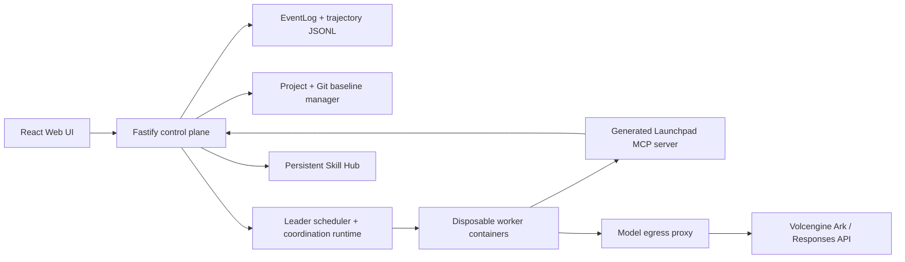

# Bevy

Bevy is our TikTok TechJam 2026 Middleware Track submission. It starts from the
provided local Agent starter kit and adds the missing continuity layer around a
coding agent: traceability while a run is happening, coordination across a
leader-led team, and reusable skills that survive into future sessions.

## Selected track

**TikTok TechJam 2026 Track 1: Middleware.**

Within the Agent Middleware challenge, this project declares **The Glass Box
(Trace and Audit)** as the selected middleware focus: a reviewer should be able
to understand what an Agent did, where it failed, and how much model usage it
consumed from the browser and from persisted backend evidence.

The project then builds on that trace substrate to support leader-led
multi-agent work and cross-session skill reuse. Those features are included
because they are middleware-owned continuity problems, not because the model was
changed or retrained.

## Why we built it

A coding agent works well when one task fits inside one conversation. Larger
software work is different: research, backend implementation, frontend work,
testing, and review can often happen in parallel, but one agent has to do them
one after another. Starting more agents is easy; making them work as a team is
the hard part.

The starter platform already provided a browser UI, a Fastify control plane,
persistent workspaces, and Codex running in disposable containers against a
Volcengine Ark Responses endpoint. What it did not provide was enough
middleware to coordinate several agents, show how their work fits together, or
carry a useful method from one session into the next.

Bevy fills that gap. The control plane owns the durable event stream,
identity-scoped team communication, shared artifacts, bounded Git contributions,
token/cost attribution, and the persistent Skill Hub.

## What it does

### 1. Makes every run inspectable

- Captures reasoning, command execution, file changes, tool calls, messages,
  status, duration, errors, and token usage from real runtime events.
- Persists events as append-only JSONL after redaction and truncation.
- Shows the same records in the browser timeline, plan panel, usage summary,
  worker tree, artifacts view, and coordination transcript.
- Routes model traffic through a control-plane egress proxy so provider
  credentials stay outside worker containers and calls remain attributable to a
  run and agent.

This is the core Glass Box track requirement: the UI is not a static log page.
It is a reader over the same event stream the backend uses for recovery,
diagnosis, spend estimates, and fault evidence.

### 2. Coordinates a leader-led team

- A leader creates named subtasks with explicit dependencies.
- The middleware validates the dependency graph before workers start.
- Independent subtasks run as parallel scheduler waves; downstream work waits
  for its required inputs.
- Workers have isolated execution contexts plus a common workspace for
  artifacts, messages, and installed skills.
- Coding workers return bounded Git contributions instead of blindly editing
  the same canonical checkout.
- The leader evaluates results, integrates verified contributions, and returns
  one final answer.

### 3. Lets agents communicate without losing control

Agent-to-agent communication is middleware, not just chat text. Launchpad
supports three delivery modes:

- `quiet`: queue for the recipient's next turn with no extra model call.
- `talk`: join an active turn, or queue if the recipient is idle.
- `wakeup`: start a new turn immediately, spending from the team follow-up
  budget.

The sender identity comes from a scoped token issued by the control plane, not
from a name written inside the message. Messages are journaled before delivery,
so pending work can be reconstructed after restart. One token ledger covers the
leader and every worker.

### 4. Reuses proven methods through a Skill Hub

An agent can turn a validated workflow into a versioned skill package. The Skill
Hub stores the package outside disposable runtime workspaces, records origin and
evidence metadata, and exposes it through both MCP tools and the browser.

Before a future run starts, a deterministic router can rank matching skills,
reject unsafe provenance, and install one high-confidence package into the
team's shared workspace. Low-confidence matches are shown as a shortlist rather
than silently injected.

## Architecture



Key boundaries:

- The **model** decides what to say and build.
- The **leader** decides how to split a complex task.
- The **middleware** owns identity, delivery semantics, persistence,
  redaction, budgets, Git integration, skill routing, and failure states.
- The **browser** renders backend records; it does not invent execution state.

More detail lives in:

- [Architecture](docs/ARCHITECTURE.md)
- [Design overview](docs/design/README.md)
- [Trace and audit](docs/design/trace.md)
- [Coordination](docs/design/coordination.md)
- [Skills](docs/design/skills.md)
- [Interface](docs/design/interface.md)

## Demo path for judges

1. Start the local POC.
2. Create or open a Project in the sidebar.
3. Run a normal coding task with a leader, for example:

   ```text
   Build a small TypeScript utility, add tests, and verify it.
   ```

4. Open the run timeline and show commands, file changes, tool calls, messages,
   worker membership, usage, artifacts, and final result.
5. Trigger a failure case, for example a task that runs a failing test or
   attempts a protected-path change.
6. Use the trace to identify the failing step, error context, and recorded
   middleware response.
7. State one known limitation from the section below.

The intended three-minute story is: a real Agent run reaches backend
middleware, the middleware records or denies something meaningful, and the UI
lets a reviewer explain the outcome quickly.

## Requirements

- Node.js 22+
- npm 10+
- Docker, Colima, or Podman
- A Volcengine Ark API key and endpoint that supports the Responses API

Codex CLI is included in the runtime image for the local POC and is not required
on the host. For local development outside containers, install the Codex CLI on
the host.

## Run locally

Start the complete local browser POC:

```bash
ARK_API_KEY=your-ark-api-key \
ARK_MODEL=ep-your-endpoint-id \
npm run poc
```

Open <http://localhost:3000>.

The first run installs dependencies and builds the runtime image. The startup
script automatically selects Docker, Colima, or Podman. To force an engine:

```bash
CONTAINER_ENGINE=podman \
ARK_API_KEY=your-ark-api-key \
ARK_MODEL=ep-your-endpoint-id \
npm run poc
```

Persistent local state defaults to:

- macOS: `~/.volc-agent-launchpad/`
- Linux: `.local/`
- Custom location: set `LOCAL_POC_DATA_ROOT`

Press `Ctrl+C` to stop the server. Workspaces, conversations, Project
baselines, traces, and skills remain on disk.

## Work with existing repositories

To allow Launchpad to open existing folders from the browser, set a server-local
allowlist before startup:

```bash
export WORKSPACE_SOURCE_ROOTS="/absolute/allowed/root"
ARK_API_KEY=your-ark-api-key ARK_MODEL=ep-your-endpoint-id npm run poc
```

The sidebar maps user-facing actions to backend source modes:

```text
Create new project      -> managed Git repo under workspaces/projects/<slug>
Open existing folder    -> server-local allowlisted Git repo
New chat inside Project -> run from that Project's durable baseline
Temporary chat          -> legacy ephemeral agent workspace
```

Project-backed runs create isolated worktrees under
`<workspace-root>/.runs/<run-id>/`, integrate onto `launchpad/run/<run-id>`,
and advance `launchpad/project/<project-id>` only after verified integrations
and an explicit successful task outcome. Launchpad never lands changes onto the
user's checked-out branch automatically.

## Development

```bash
npm install
cp .env.example .env
npm install --global @openai/codex@0.111.0
npm run dev
```

- Web UI: <http://localhost:5173>
- API: <http://localhost:3000>

Use local paths in `.env` when running outside Docker:

```dotenv
APP_DATA_DIR=.data
AGENT_WORKSPACE_ROOT=workspaces
CODEX_HOME=codex-home
```

Common commands:

```bash
npm run typecheck
npm run test
npm run build
npm run check
```

Focused test examples:

```bash
npm run test -w @launchpad/server -- coordination-delivery.test.ts
npm run test -w @launchpad/server -- launchpad-mcp-server.test.ts
npm run test -w @launchpad/web -- ToolTimeline.test.tsx
```

## Deployment

The judged path is the local Docker/Colima/Podman POC. ECS is optional.

For Docker Compose:

```bash
./scripts/bootstrap-local.sh
```

Set required values in `.env`:

```dotenv
ARK_API_KEY=your-ark-api-key
ARK_MODEL=ep-your-endpoint-id
APP_AUTH_TOKEN=replace-with-at-least-24-random-characters
```

Start:

```bash
docker compose up --build
```

Open <http://localhost:3000>. Stop without deleting Agent data:

```bash
docker compose down
```

For ECS deployment options, see [docs/DEPLOYMENT.md](docs/DEPLOYMENT.md).

## Evidence and tests

The middleware behavior is covered by backend and frontend tests rather than
only by screenshots:

- Trace, redaction, event persistence, usage: `run-events`, `event-log`,
  `redact`, `model-proxy`, `pricing`.
- Team coordination: `coordination-delivery.test.ts`,
  `coordination-ingress.test.ts`, `coordination-budget.test.ts`,
  `coordination-anomaly.test.ts`.
- Scheduler and orchestration contracts: `orchestration-scheduler.test.ts`,
  `orchestration-runtime-lifetime.test.ts`,
  `orchestrator-worker-prompt.test.ts`.
- Skill Hub and routing: `launchpad-mcp-server.test.ts`,
  `orchestration-skill-router.test.ts`, `skill-hub.test.ts`.
- Browser evidence surfaces: `ToolTimeline.test.tsx`,
  `AgentMessages.test.tsx`, `SkillHub.test.tsx`,
  `UsageSummary.test.tsx`, `MissionPhases.test.tsx`.

Run the full verification sweep with:

```bash
npm run check
```

## Known limitations

- This is a single-user proof of concept, not hardened multi-tenant
  infrastructure.
- Local runtime containers are resource-limited, but arbitrary outbound network
  destinations are not allowlisted.
- The browser polls run endpoints rather than using a push channel.
- Cost numbers are estimates from token usage and configured or published
  rates; they are not billing truth.
- Redaction is field-shape based and bounds long strings, but it cannot
  recognize every credential if a prompt prints it as ordinary prose.
- Promotion into the global Skill Hub is not yet human-gated after validation.
- Bounded self-healing and exact-repeat failure memory exist behind flags and
  deterministic fixtures, but they are not presented as the primary production
  demo path.

Do not use production data or long-lived credentials with this POC. See
[SECURITY.md](SECURITY.md) for the security posture.

## Repository map

```text
apps/web/                         React + Vite browser interface
apps/server/                      Fastify control plane and runtime adapters
apps/server/src/coordination/     Team messaging, journal, roster, budget
apps/server/src/orchestration/    Leader planning, scheduling, integration
apps/server/src/runtime/          Runtime abstraction and session protocol
docs/design/                      Design notes for trace, coordination, skills, UI
docs/LOCAL_POC.md                 Local runtime operations and troubleshooting
docs/DEPLOYMENT.md                ECS and Docker Compose deployment notes
```

## Origin

Bevy was built from the Volc Agent Launchpad starter kit for a three-day
middleware challenge. The starter lifecycle and Playground remain available,
but the submission work is the middleware layer around it: a real trace/audit
path first, then coordinated team execution and validated reusable skills on top
of that record.
