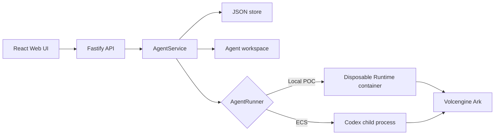

# Architecture

Volc Agent Launchpad is a single-node control plane for hackathon use.



## Components

### Web UI

Lists Agents, manages lifecycle actions, submits prompts, and polls asynchronous
Runs. It never receives the Ark API key.

### Fastify API

Validates requests, protects remote demos with a shared bearer token, and
serves the compiled Web UI. The token is not user identity or authorization.

### AgentService

Coordinates lifecycle state, persistence, workspaces, and Runs. One Agent can
have only one active Run.

```text
ready -> busy -> ready
  |       |
  v       v
stopped  error
```

Interrupted Runs become `cancelled` after a restart.

### Projects and Chats

The product hierarchy is:

```text
Project → Chat/Agent → Run → Subtask/attempt
```

A **Project** is a durable Git repository identity (managed under
`workspaces/projects/<slug>` or an external allowlisted path). Each Project owns
a Launchpad baseline branch `launchpad/project/<project-id>` and a durable
`baselineCommit`. Identity is resolved from realpath and Git common-directory
device/inode authority, not display names or remote URLs. Linked worktrees that
share one Git common directory map to one Project; separate clones remain
separate Projects.

A **Chat** is a top-level Agent with `projectId` set. New Chats inside a Project
inherit that Project's captured baseline at Run admission. Temporary Chats
(`projectId` absent) keep the legacy ephemeral Agent workspace and stay outside
the Projects hierarchy. Worker Agents inherit execution context but never appear
as Project chats.

Each **Run** still owns `launchpad/run/<run-id>`. Project-backed coding uses
isolated attempt workspaces derived from the captured Project baseline; leaders
must not write coding contributions into `<workspaceRoot>/<agent-id>`.

**Baseline advancement** is an exact expected-head compare-and-swap on
`launchpad/project/<id>`. Only Runs with verified integrations and an explicit
successful task outcome may advance it. Failed, cancelled, unknown-outcome,
zero-integration, conflicting, or stale-baseline Runs leave the newer baseline
unchanged. Restart recovery preserves the last durable baseline and reconciles
interrupted publication intents without restarting agents.

**Control-loop completion and task outcome are separate claims.** A Run may
finish its orchestration loop as `completed` while the product task outcome is
non-success (for example zero integrations). A natural-language final message
alone cannot establish a successful project-backed coding outcome or advance
the Project baseline.

### Git-backed project execution

Coding Runs separate five workspace roles:

1. The **canonical run workspace** is the middleware-owned checkout for
   `launchpad/run/<run-id>` and the source of truth for integrated code.
2. An **attempt workspace** is an isolated worktree at one declared base commit
   for one subtask attempt.
3. A **repair workspace** is an isolated candidate worktree derived from one
   failed-attempt checkpoint. Milestone 1 reserves this role but does not run a
   healing tournament.
4. The **shared exchange** (`.shared/<leader-run>`) carries team messages and
   content-addressed handoff artifacts. It is coordination state, never
   canonical source or promotion authority.
5. The **authority workspace** holds protected verifier configuration, tests,
   fixtures, and helpers outside candidate control. Trusted use begins in
   Milestone 2.

`ProjectRunManager` resolves an explicit source and creates the run branch.
Workers edit only attempt worktrees. `ContributionCollector` accepts exactly
one clean child commit, and `ContributionIntegrator` applies same-wave commits
serially in planner order. Dependents become runnable only after their producers
integrate. A conflict is aborted, the prior canonical head remains authoritative,
and the conflicting attempt is preserved for inspection.

Team coordination and canonical Git integration are intentionally separate:
messages and artifacts may inform a worker, but only middleware-owned structural
checks and the serialized integration queue can change the run branch. The
Milestone 1 gate proves Git structure and provenance only; it does not authorize
semantic correctness, promotion, or healing. Trusted semantic verification and
bounded self-healing begin in Milestone 2.

### Storage

```text
data/launchpad.json              Agent, Project, message, and Run metadata
data/events/<session>/manifest.json       Stable run/member placement
data/events/<session>/<member>/trajectory.jsonl
                                         Append-only member event trace
data/events/<session>/<member>/workspace/
data/events/<session>/common/             Leader/member/common coordination workspaces
data/events/.deleted/                     Archived session/member traces
workspaces/projects/<slug>/      Managed Project repositories
workspaces/.runs/<run-id>/       Managed Project canonical, attempt, and repair worktrees
workspaces/<agent-id>/           Temporary/legacy Agent workspaces
workspaces/.deleted/             Archived deleted workspaces
codex-home/                      Codex configuration and sessions
```

External Projects keep their original server-local paths; Launchpad registers
identity but never relocates them. Run logical history is persisted as run,
attempt, contribution, and integration records rather than as permanent
worktree branches. Managed Projects beneath `AGENT_WORKSPACE_ROOT` are admitted
automatically; no duplicate `WORKSPACE_SOURCE_ROOTS` entry is required.

The authority profile and every listed gate, mutant, fixture, and helper must
live outside EventLog session directories, managed Project `.runs`, Project
repositories, and all configured workspace source roots.

`JsonStore` serializes writes and atomically replaces one JSON file. It supports
one process only.

### Runtime providers

- `CodexRunner` runs Codex inside the application container for ECS.
- `ContainerCodexRunner` starts one disposable Docker, Colima, or Podman
  container for every local turn.

Both providers use argv-only process execution, bound output and time, resume
the stored Codex thread, and escalate termination after a grace period.

## Deployment profiles

| Profile | Control plane | Agent execution |
| --- | --- | --- |
| Local POC | Host Node.js | Disposable local container |
| ECS | Application container | Codex process in the same container |
| Local development | Host Node.js | Host Codex process |

## Extension seams

| Track | Primary seam | Expected change |
| --- | --- | --- |
| Glass Box | `AgentRunner`, `AgentRun` | Implemented: RunEventSink, EventLog and the Playground timeline. |
| Bouncer | API routes, Agent ownership | Add identity and server-side authorization. |
| Kill Switch | `AgentRunner` | Add threat-specific policy or a stronger sandbox. |

The current container or ECS instance is the POC trust boundary. Ordinary
containers are not hardened multi-tenant isolation.

## Bounded self-healing

Project orchestration can recover one repairable coding failure without giving
the model authority to decide what is correct. The middleware owns the state
machine: it captures a Git checkpoint, freezes evidence, diagnoses the failure,
runs exactly one three-way tournament (`control`, `context_patch`, and
`strategy_patch`), verifies every finalist against protected authority, selects
one deterministic winner, and queues that contribution through the normal
integration path. A dependent node is released only after the producer commit
passes the post-integration gate.

The trusted boundary is deliberately asymmetric. Candidate processes may write
only their isolated worktree. Verification profiles, gates, mutants, fixtures,
and helpers live outside candidate-controlled workspaces, are copied into the
verifier sandbox, and are integrity checked before and after each run. The
control candidate remains eligible and wins an exact tie. Candidate-authored
tests are supplementary evidence only; they cannot replace authority gates.

Every wait races the root deadline, cancellation, emergency token/model-call
fuses, and the local operation. Owner/revision compare-and-swap settlement makes
late results stale. Missing or malformed diagnosis, unavailable checkpoints,
authority compromise, verification failure, promotion conflicts, and failed
post-integration verification all stop closed. The canonical run workspace is
reset to its prior clean head after a failed integration; the user's source
branch is never checked out or modified.

Healing is disabled by default. Enabling it requires
`ORCHESTRATION_HEALING_ENABLED=true` and a trusted
`ORCHESTRATION_VERIFICATION_PROFILE`. Configuration validation fixes the
tournament count at one and candidate count at three. The remaining
`ORCHESTRATION_*` and `VERIFIER_CONTAINER_*` ceilings are documented in
`.env.example`.

Provider `429` responses are infrastructure truth. They stop admission, remain
non-repairable, and are never relabelled as an agent/task failure. Leader, solo,
live async-dispatch, worker, verifier, integration, and repair waits all remain
bounded by the same root lifetime. A worker timeout lease is granted only from
a fresh trusted progress checkpoint and can never extend past that root.

Milestone 2 keeps normal live-DAG admission, but freezes graph authority while a
repair tournament is active. A durable repair-graph fence binds the graph
revision, contract hashes, candidates, verification, integration, and branch
returns. Already-admitted siblings may finish; new nodes and contract changes
resume only after terminal settlement.

## Evolution history and exact-repeat pruning

Milestone 3 adds a Project-scoped logical lineage graph beneath
`APP_DATA_DIR/evolution/projects/`. Immutable, hash-chained segments reference
content-addressed verification objects beneath `APP_DATA_DIR/evidence/sha256/`;
they do not require repair worktrees to remain on disk. Cleanup may remove only
proven unpublished temp files and clean redundant worktrees. Corrupt or
ambiguous history bytes and referenced evidence are preserved.

Exact-repeat pruning requires equality of all six canonical version-2 fields:
repository base, compiled subtask contract, authority manifest, complete runtime
capability/harness, normalized candidate-visible fault evidence, and complete
prompt-affecting mutation content. Only audited deterministic negative candidate
outcomes are eligible. Successful/promoted, provider, authority, cancellation,
legacy/incomplete, contradicted, corrupt, missing-evidence, owner-mismatched, and
over-quota history never prunes or supplies cues. If history is unavailable,
the bounded Milestone 2 tournament executes unchanged.

Evidence persistence is not part of Milestone 2 fault authority: a storage
rejection cannot erase the live fault or prevent diagnosis and repair. The
resulting fault has no durable evidence references, which is deliberately
ineligible for Milestone 3 historical authority and is quarantined as missing
evidence before it can prune, cue, or produce a failure capsule.

The pending per-run history outbox is capped at 1,000 entries or 16 MiB. The
store defaults to a 1 GiB quota. Startup reconciliation runs only after
Milestone 2 restart recovery, processes at most 100 items or five seconds per
pass, and leaves durable pending state for a later pass. It never re-runs a
model, worker, verifier, integration, or Git mutation.

Failure cues are deterministic, advisory, limited to three, and may enrich the
context candidate once. They cannot remove a strategy family or change tools,
authority, budgets, ranking, or expected outcomes. Transfer observations are
passive comparisons of later natural trials and do not launch replay work.

These are three separate reuse operations. An exact audited negative may prune
only its matching family. An analogous non-exact failure may supply bounded
context cues but never hard-prune. A material fingerprint change executes the
ordinary bounded tournament. Whole-record auditing fails the entire candidate
closed when any ownership, lifecycle, verification, fingerprint, or evidence
reference is malformed, missing, contradictory, or untrusted.

Terminal weak continuations may record a bounded failure capsule, a
`branch_pruned` observation, and a `returned_to` edge to their frozen parent
checkpoint. This branch return is passive memory: it does not create a fourth
candidate, replay work, or interfere with a successful sibling.

`GET /api/runs/:id?includeEvolution=true&evolutionLimit=100&evolutionDepth=4`
returns a bounded, recursively redacted projection with a signed cursor. The
run-level Evolution panel appears after the run summary and renders separate
lifecycle counts, lineage edges, primary fault, branch/commits, restart/sync
health, cue/transfer counts, and quarantine reasons. Its branch history starts
collapsed and becomes a vertical lineage on narrow layouts. Existing
Projects/Chats navigation is unchanged.

All detailed M3 authority is Project-local. A later global harness catalog may
accept only audited, sanitized, compatibility-bound lessons and initially use
them as advisory input. Raw Project evidence never crosses that boundary and no
Project history directly changes another Project's pruning or live harness.

Services that own timers, watchers, outbox drains, child processes, or server
handles own idempotent close operations. Reconciliation itself is bounded and
passive; shutdown closes stores and servers twice safely and never relies on a
forced process exit. The production acceptance fixture reconstructs and closes
that complete ownership graph three times. Every cycle executes a real
production run, replays its durable outbox through reconciliation, then compares
OS timer, watcher, server, and `ChildProcess` handles and verifies the outbox and
coordination endpoint are drained after double-close.

Automatic skill synthesis or promotion, active transfer experiments, semantic
pruning, RLM, DCI, dynamic teams, and healing-time DAG evolution remain outside
this milestone and require a separate approved design.
